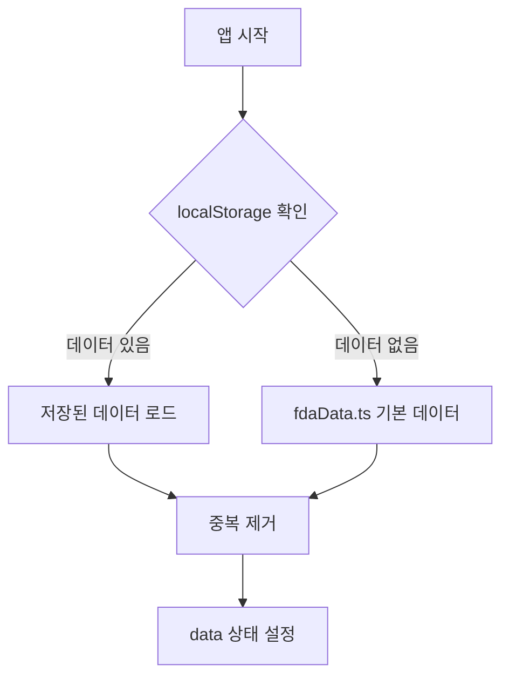

# US FDA 승인 전문의약품 대시보드 - 기술 문서

## 목차
1. [개요](#개요)
2. [기술 스택](#기술-스택)
3. [데이터 아키텍처](#데이터-아키텍처)
4. [핵심 컴포넌트](#핵심-컴포넌트)
5. [데이터 흐름](#데이터-흐름)
6. [주요 기능 구현](#주요-기능-구현)
7. [파일 구조](#파일-구조)

---

## 개요

미국 FDA 전문의약품 승인 데이터를 시각화하고 관리하는 대시보드 애플리케이션입니다. 신약(NDA/BLA) 최초 승인, 제형 변경, 조합 제품, 적응증 추가 등 전문의약품의 주요 승인 내역을 포함합니다.

---

## 기술 스택

| 분류 | 기술 |
|------|------|
| **프레임워크** | React 18 + TypeScript |
| **빌드 도구** | Vite |
| **스타일링** | Tailwind CSS + shadcn/ui |
| **차트** | Recharts |
| **엑셀 처리** | ExcelJS |
| **백엔드** | Lovable Cloud (Edge Functions) |
| **상태 관리** | React useState + useMemo |
| **데이터 지속성** | localStorage |

---

## 데이터 아키텍처

### 데이터 인터페이스 (`DrugApproval`)

```typescript
interface DrugApproval {
  applicationNo: string;      // 허가번호 (숫자만)
  applicationType: "NDA" | "BLA";
  brandName: string;          // 제품명 (영문)
  brandNameKorean: string;    // 제품명 (국문)
  activeIngredient: string;   // 성분명 (영문)
  activeIngredientKorean: string;
  sponsor: string;            // 제조사
  approvalDate: string;       // YYYY-MM-DD
  therapeuticArea: string;    // 치료 영역
  indication: string;         // 적응증 (영문)
  indicationKorean: string;   // 적응증 (국문)
  isOncology: boolean;        // 항암제 여부
  isBiosimilar: boolean;      // 바이오시밀러 여부
  isNovelDrug: boolean;       // 신약 여부
  isOrphanDrug: boolean;      // 희귀의약품 여부
  ndaBlaNumber: string;       // "NDA 123456" 형식
  fdaUrl: string;             // FDA 공식 링크
  supplementCategory?: string; // 변경 카테고리 (ORIG-1, SUPPL 등)
  isCberProduct?: boolean;    // CBER 규제 제품 여부
}
```

### 데이터 계층 구조

```
┌─────────────────────────────────────────────────────────────┐
│                    사용자 인터페이스                          │
├─────────────────────────────────────────────────────────────┤
│                                                             │
│  ┌─────────────┐    ┌─────────────┐    ┌─────────────┐     │
│  │   필터링    │    │   테이블    │    │   차트      │     │
│  │  Filters    │    │  DrugTable  │    │  Charts     │     │
│  └─────────────┘    └─────────────┘    └─────────────┘     │
│                                                             │
├─────────────────────────────────────────────────────────────┤
│                    상태 관리 (Index.tsx)                     │
│  ┌─────────────────────────────────────────────────────┐   │
│  │  data (DrugApproval[]) ←→ filters ←→ filteredData   │   │
│  └─────────────────────────────────────────────────────┘   │
├─────────────────────────────────────────────────────────────┤
│                    데이터 지속성                             │
│  ┌─────────────────────────────────────────────────────┐   │
│  │  localStorage: fda_approvals_overrides_v1           │   │
│  └─────────────────────────────────────────────────────┘   │
├─────────────────────────────────────────────────────────────┤
│                    기본 데이터                               │
│  ┌─────────────────────────────────────────────────────┐   │
│  │  src/data/fdaData.ts (정적 데이터)                   │   │
│  └─────────────────────────────────────────────────────┘   │
└─────────────────────────────────────────────────────────────┘
```

---

## 핵심 컴포넌트

### 1. Index.tsx (메인 페이지)

**역할**: 전체 상태 관리 및 컴포넌트 조합

```typescript
// 데이터 로드 우선순위
const [data, setData] = useState<DrugApproval[]>(
  () => loadPersistedData() ?? fdaApprovals
);

// 필터링된 데이터 (메모이제이션)
const filteredData = useMemo(() => {
  return applyFilters(data, filters);
}, [data, filters]);

// 통계 계산 (메모이제이션)
const stats = useMemo(() => ({
  total, oncology, biosimilar, novelDrug, orphanDrug, blaCount, ndaCount
}), [filteredData]);
```

### 2. Filters.tsx (필터링)

**지원 필터**:
- 기간 (전체/1개월/3개월/6개월/1년/사용자 지정)
- 신청 유형 (NDA/BLA)
- 제조사
- 치료 영역
- 항암제/바이오시밀러/신약/희귀의약품

```typescript
export function applyFilters(
  data: DrugApproval[], 
  filters: FilterState
): DrugApproval[] {
  return data.filter((drug) => {
    // 각 필터 조건 적용
    if (filters.applicationType !== "all" && 
        drug.applicationType !== filters.applicationType) return false;
    // ... 기타 필터
    return true;
  });
}
```

### 3. DrugTable.tsx (데이터 테이블)

**기능**:
- 통합 검색 (제품명, 성분명, 스폰서, 치료영역, 허가번호)
- 상세 정보 팝업
- FDA 링크 연결

### 4. FdaValidation.tsx (FDA 검증)

**워크플로우**:
1. Edge Function 호출 → openFDA API 검증
2. 불일치 항목 표시
3. 수동 수정 (드래프트 상태)
4. "적용하기" 클릭 → 최종 반영

### 5. ExcelUpload.tsx / FdaNovelDrugsExport.tsx

**엑셀 내보내기 시트 구성**:
| 시트명 | 내용 |
|--------|------|
| Summary | 통계 및 색상 범례 |
| 국문 상세 | 한글 상세 정보 |
| English Details | 영문 상세 정보 |
| 최초승인(ORIG-1) | 최초 승인 목록 |
| 변경승인(SUPPL) | 변경 승인 목록 |

---

## 데이터 흐름

### 초기 로드



### 데이터 수정


### 중복 제거 로직

```typescript
function deduplicateData(data: DrugApproval[]): DrugApproval[] {
  const seen = new Set<string>();
  return data.filter((drug) => {
    // 고유 키: 허가번호 + 승인일 + 제품명 + 변경카테고리
    const key = `${drug.applicationNo}-${drug.approvalDate}-${drug.brandName}-${drug.supplementCategory || ""}`;
    if (seen.has(key)) return false;
    seen.add(key);
    return true;
  });
}
```

---

## 주요 기능 구현

### 1. FDA URL 생성

```typescript
// CDER 제품 (일반)
const generateFdaUrl = (applicationNo: string): string => {
  return `https://www.accessdata.fda.gov/scripts/cder/daf/index.cfm?event=overview.process&ApplNo=${applicationNo}`;
};

// CBER 제품 (예외 처리)
const CBER_PRODUCT_URLS: Record<string, string> = {
  "BREYANZI": "https://www.fda.gov/vaccines-blood-biologics/...",
  "AVANCE": "https://www.fda.gov/vaccines-blood-biologics/...",
  // ...
};
```

### 2. 허가번호 정규화

```typescript
// 중복 접두어 제거: "BLA BLA 123456" → "123456"
const normalizeApplicationNo = (appNo: string): string => {
  return appNo.replace(/^(BLA|NDA)\s+/i, "").trim();
};
```

### 3. FDA API 검증 (Edge Function)

```typescript
// supabase/functions/validate-fda-data/index.ts
const fdaUrl = `https://api.fda.gov/drug/drugsfda.json?search=application_number:"${applicationType}${applicationNo}"&limit=1`;

// 응답 검증
const isValid = fdaBrandNames.some(
  (name) => name.toUpperCase().replace(/[^A-Z0-9]/g, "") === normalizedBrandName
);
```

### 4. 데이터 지속성

```typescript
const LOCAL_DATA_KEY = "fda_approvals_overrides_v1";

// 저장
function persistData(data: DrugApproval[]) {
  localStorage.setItem(LOCAL_DATA_KEY, JSON.stringify(data));
}

// 로드
function loadPersistedData(): DrugApproval[] | null {
  const raw = localStorage.getItem(LOCAL_DATA_KEY);
  return raw ? deduplicateData(JSON.parse(raw)) : null;
}
```

---

## 파일 구조

```
src/
├── pages/
│   └── Index.tsx              # 메인 대시보드 페이지
├── components/
│   └── dashboard/
│       ├── Header.tsx         # 헤더 (메타정보, 액션 버튼)
│       ├── Filters.tsx        # 필터링 UI 및 로직
│       ├── DrugTable.tsx      # 데이터 테이블
│       ├── StatCard.tsx       # 통계 카드
│       ├── TherapeuticAreaChart.tsx  # 치료영역 차트
│       ├── Highlights.tsx     # 주요 하이라이트
│       ├── FdaValidation.tsx  # FDA API 검증
│       ├── FdaNovelDrugsExport.tsx   # 엑셀 내보내기
│       ├── ExcelUpload.tsx    # 엑셀 업로드
│       └── UsageGuide.tsx     # 사용 가이드
├── data/
│   └── fdaData.ts             # 기본 데이터 및 타입 정의
└── integrations/
    └── supabase/
        └── client.ts          # Supabase 클라이언트

supabase/
└── functions/
    └── validate-fda-data/
        └── index.ts           # FDA 검증 Edge Function
```

---

## 개발 가이드

### 새로운 데이터 필드 추가

1. `src/data/fdaData.ts`에서 `DrugApproval` 인터페이스 수정
2. 기존 데이터에 새 필드 추가 (기본값 설정)
3. 관련 컴포넌트 업데이트 (테이블, 필터, 내보내기)

### 새로운 필터 추가

1. `Filters.tsx`의 `FilterState` 인터페이스 확장
2. `applyFilters` 함수에 필터 로직 추가
3. UI 컴포넌트 추가

### 엑셀 내보내기 수정

`FdaNovelDrugsExport.tsx`의 시트 생성 로직 수정

---

## 주의사항

1. **데이터 정합성**: 모든 허가번호는 공식 FDA 데이터와 대조 검증 필요
2. **CBER 제품**: 별도 URL 매핑 필요 (자동 생성 불가)
3. **localStorage 용량**: 대량 데이터 시 용량 제한 고려 (약 5MB)
4. **FDA API 제한**: Rate limit 40 req/min (API key 없이)
