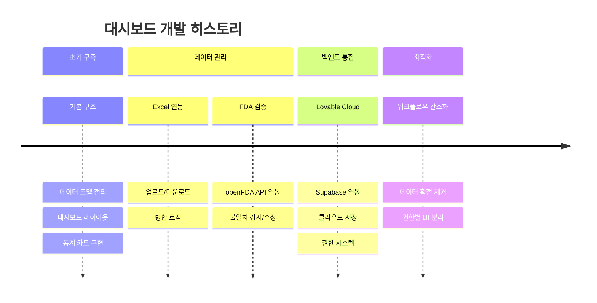
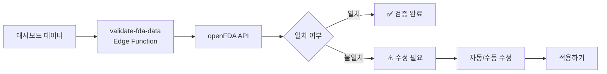

# US FDA 승인 전문의약품 대시보드 - 개발 히스토리

## 📅 프로젝트 타임라인



---

## 🏗️ Phase 1: 기본 구조 구축

### 데이터 모델 설계

```typescript
interface DrugApproval {
  applicationNo: string;        // 허가번호
  applicationType: "NDA" | "BLA";
  brandName: string;            // 제품명 (영문)
  brandNameKorean: string;      // 제품명 (국문)
  activeIngredient: string;     // 성분명
  sponsor: string;              // 제조사
  approvalDate: string;         // 승인일
  therapeuticArea: string;      // 치료 영역
  indication: string;           // 적응증
  isOncology: boolean;          // 항암제
  isBiosimilar: boolean;        // 바이오시밀러
  isNovelDrug: boolean;         // 신약
  isOrphanDrug: boolean;        // 희귀의약품
  supplementCategory?: string;  // ORIG-1 / SUPPL
  // ... 기타 필드
}
```

### 주요 컴포넌트 구현

| 컴포넌트 | 기능 |
|----------|------|
| `StatCard` | 통계 카드 (총 승인, 항암제, 바이오시밀러 등) |
| `Filters` | 기간/유형/치료영역 필터링 |
| `DrugTable` | 데이터 테이블 + 통합 검색 |
| `TherapeuticAreaChart` | 치료영역별 분포 차트 |

---

## 📊 Phase 2: UI/UX 개선

### 레이아웃 변경 이력

1. **"승인유형 분석" 섹션 제거** - 불필요한 중복 정보
2. **"특별지정현황" 섹션 제거** - UI 간소화
3. **적응증별 분포 차트**: "전체"와 "항암제" 병렬 레이아웃으로 변경

### 헤더 구조 최적화

```
┌─────────────────────────────────────────────────────────────┐
│  US FDA 승인 전문의약품 (메인 타이틀, whitespace-nowrap)      │
├─────────────────────────────────────────────────────────────┤
│  부제목 | 항목 수 | 데이터 기준일 | [기능 버튼들]            │
├─────────────────────────────────────────────────────────────┤
│  데이터 출처: FDA Official, Drugs.com 등                    │
└─────────────────────────────────────────────────────────────┘
```

### 통계 카드 개선

- 아이콘별 고유 색상 적용 (시각적 구분)
- 총 승인 카드에 최초승인/변경승인 breakdown 추가

---

## 📥 Phase 3: 데이터 입출력

### 엑셀 업로드 기능

**핵심 설계 결정:**
- ❌ 덮어쓰기 방식 → ✅ **병합(Merge) 방식**
- 기존 데이터 보존, 신규 항목만 추가

**중복 제거 로직:**
```typescript
// 고유 키: 허가번호 + 승인일 + 변경카테고리
const key = `${drug.applicationNo}-${drug.approvalDate}-${drug.supplementCategory || ""}`;
// 제품명은 키에서 제외 (동일 허가번호의 변형 제품 통합)
```

### 엑셀 내보내기 기능

**5개 시트 구성:**
1. **Summary** - 통계 + 색상 범례
2. **국문 상세** - 한글 상세 정보
3. **English Details** - 영문 상세 (한글 문자 차단 로직)
4. **최초승인(ORIG-1)** - 최초 승인 목록
5. **변경승인(SUPPL)** - 변경 승인 목록

---

## 🔍 Phase 4: FDA API 검증

### openFDA API 연동



### 드래프트 커밋 방식

- 수정 사항은 임시 상태로 유지
- "적용하기" 버튼 클릭 시 최종 반영
- 검증 창 닫기 전까지 롤백 가능

### CBER 제품 예외 처리

일부 제품(BREYANZI, AVANCE 등)은 CBER 관할로 별도 URL 매핑 필요

---

## 💾 Phase 5: 데이터 지속성

### localStorage 캐싱 (초기 구현)

```typescript
const LOCAL_DATA_KEY = "fda_approvals_overrides_v1";

// 저장
localStorage.setItem(LOCAL_DATA_KEY, JSON.stringify(data));

// 로드 (기본 데이터보다 우선)
const saved = localStorage.getItem(LOCAL_DATA_KEY);
```

### 캐시 무효화 시스템

**Data Fingerprint 방식:**
```typescript
const fingerprint = {
  count: data.length,
  firstId: data[0]?.applicationNo,
  lastId: data[data.length - 1]?.applicationNo,
  totalLength: data.map(d => d.applicationNo).join('').length
};
```
- 소스 데이터 변경 시 자동 캐시 클리어

---

## ☁️ Phase 6: Lovable Cloud 통합

### 클라우드 저장 시스템 도입

**데이터베이스 스키마:**
```sql
-- 버전 관리 테이블
CREATE TABLE fda_data_versions (
  id UUID PRIMARY KEY,
  version_number SERIAL,
  is_published BOOLEAN,
  is_verified BOOLEAN,
  data_fingerprint TEXT,
  created_at TIMESTAMP
);

-- 데이터 행 테이블
CREATE TABLE fda_data_rows (
  id UUID PRIMARY KEY,
  version_id UUID REFERENCES fda_data_versions,
  payload JSONB
);

-- 공개 뷰 (RLS 적용)
CREATE VIEW public_fda_data_view AS
SELECT payload FROM fda_data_rows
WHERE version_id = get_latest_published_version_id();
```

### 권한 시스템 구현

```sql
-- 역할 enum
CREATE TYPE app_role AS ENUM ('admin');

-- 사용자 역할 테이블
CREATE TABLE user_roles (
  user_id UUID REFERENCES auth.users,
  role app_role
);

-- 역할 확인 함수
CREATE FUNCTION is_admin() RETURNS BOOLEAN AS $$
  SELECT has_role(auth.uid(), 'admin');
$$;
```

---

## 🔐 Phase 7: 권한 기반 UI 분리

### 사용자 권한별 기능

| 기능 | 일반 사용자 | 관리자 |
|------|:-----------:|:------:|
| 대시보드 조회 | ✅ | ✅ |
| 필터링/검색 | ✅ | ✅ |
| 사용 방법 | ✅ | ✅ |
| 엑셀 다운로드 | ✅ | ✅ |
| FDA 검증 | ❌ | ✅ |
| 엑셀 업로드 | ❌ | ✅ |
| 클라우드 저장 | ❌ | ✅ |

### 컴포넌트 리팩토링

- `AdminAuth` 컴포넌트 → `Header`로 통합
- 조건부 렌더링으로 권한별 버튼 표시

---

## 🧹 Phase 8: 워크플로우 간소화

### "데이터 확정" 기능 제거

**이전 워크플로우:**
```
FDA 검증 → 수정 → 적용 → 데이터 확정(코드 추출) → 소스 반영
```

**현재 워크플로우:**
```
FDA 검증 → 수정 → 적용 → 클라우드 저장
```

### 제거된 컴포넌트

- `DataCommit.tsx` - 코드 추출 기능 (클라우드 저장으로 대체)

---

## 📝 주요 설계 결정 요약

| 결정 사항 | 선택 | 이유 |
|-----------|------|------|
| 데이터 업로드 방식 | 병합 | 기존 데이터 보존 |
| 중복 제거 키 | 허가번호+승인일+카테고리 | 제품 변형 통합 |
| 데이터 저장 | Lovable Cloud | 영구 저장 + 다중 사용자 |
| 권한 관리 | RLS + user_roles | 보안 강화 |
| FDA 검증 | Edge Function | API 키 보호 |

---

## 🔗 관련 문서

- [대시보드 구현 기술 문서](./DASHBOARD_IMPLEMENTATION.md)
- [워크플로우 요약](./WORKFLOW_SUMMARY.md)

---

## 📌 버전 정보

- **문서 작성일**: 2026-01-29
- **현재 데이터 버전**: v2
- **기술 스택**: React 18 + TypeScript + Vite + Tailwind CSS + Lovable Cloud
