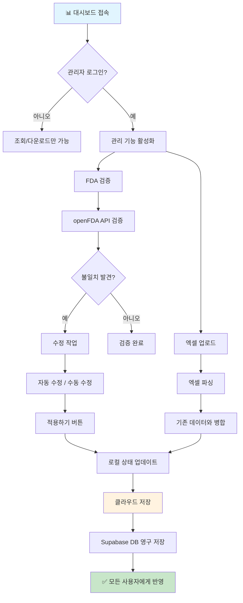
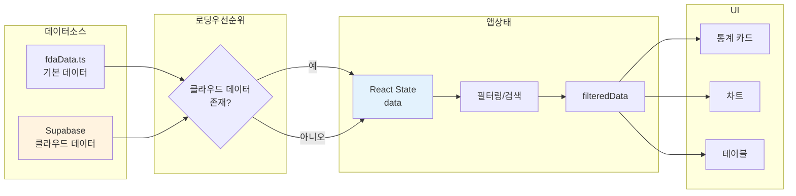
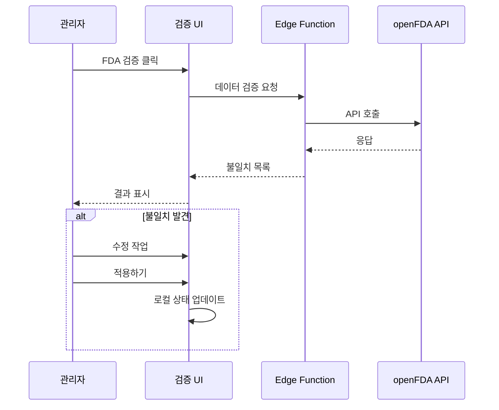
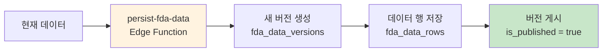
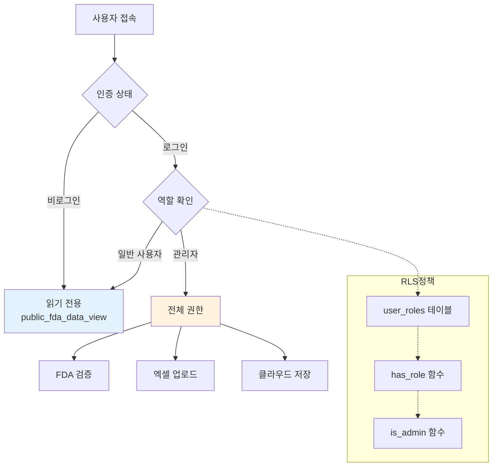

# US FDA 승인 전문의약품 대시보드 - 워크플로우 요약

## 📊 시스템 개요

미국 FDA 전문의약품 승인 데이터를 시각화하고 관리하는 대시보드입니다.

```
┌─────────────────────────────────────────────────────────────┐
│                    대시보드 아키텍처                          │
├─────────────────────────────────────────────────────────────┤
│  ┌─────────────┐    ┌─────────────┐    ┌─────────────┐     │
│  │  통계 카드   │    │  필터링     │    │  차트       │     │
│  │  StatCard   │    │  Filters    │    │  Charts     │     │
│  └─────────────┘    └─────────────┘    └─────────────┘     │
│                                                             │
│  ┌─────────────────────────────────────────────────────┐   │
│  │              데이터 테이블 (DrugTable)                │   │
│  └─────────────────────────────────────────────────────┘   │
├─────────────────────────────────────────────────────────────┤
│                    Lovable Cloud (Backend)                  │
│  ┌─────────────────────────────────────────────────────┐   │
│  │  fda_data_versions ←→ fda_data_rows (영구 저장)       │   │
│  └─────────────────────────────────────────────────────┘   │
└─────────────────────────────────────────────────────────────┘
```

---

## 👥 사용자 권한

| 기능 | 일반 사용자 | 관리자 |
|------|:-----------:|:------:|
| 대시보드 조회 | ✅ | ✅ |
| 필터링/검색 | ✅ | ✅ |
| 사용 방법 | ✅ | ✅ |
| 엑셀 다운로드 | ✅ | ✅ |
| FDA 검증 | ❌ | ✅ |
| 엑셀 업로드 | ❌ | ✅ |
| 클라우드 저장 | ❌ | ✅ |

---

## 🔄 데이터 관리 워크플로우

### 관리자 워크플로우



### 데이터 흐름



---

## 🛠 핵심 기능 상세

### 1. FDA 검증 (관리자 전용)



### 2. 엑셀 업로드 (관리자 전용)

- **병합 방식**: 기존 데이터 삭제 없이 신규 항목만 추가
- **중복 키**: `허가번호 + 승인일 + 승인유형`
- **정규화**: 허가번호 접두어 중복 제거 (예: "BLA BLA 123" → "123")

### 3. 클라우드 저장 (관리자 전용)



---

## 📁 주요 파일 구조

```
src/
├── pages/
│   └── Index.tsx              # 메인 페이지 (상태 관리)
├── components/dashboard/
│   ├── Header.tsx             # 헤더 + 권한별 버튼
│   ├── Filters.tsx            # 필터링 UI/로직
│   ├── DrugTable.tsx          # 데이터 테이블
│   ├── StatCard.tsx           # 통계 카드
│   ├── TherapeuticAreaChart.tsx
│   ├── FdaValidation.tsx      # FDA 검증 (관리자)
│   ├── FdaNovelDrugsExport.tsx # 엑셀 내보내기
│   ├── ExcelUpload.tsx        # 엑셀 업로드 (관리자)
│   └── UsageGuide.tsx         # 사용 가이드
├── data/
│   └── fdaData.ts             # 기본 데이터 + 타입
└── hooks/
    ├── useAuth.ts             # 인증/권한 관리
    └── useCloudData.ts        # 클라우드 데이터 로드

supabase/functions/
├── validate-fda-data/         # FDA API 검증
└── persist-fda-data/          # 클라우드 저장
```

---

## 🔐 보안 모델



---

## 📝 버전 정보

- **최종 업데이트**: 2026-01-29
- **데이터 스키마 버전**: v2
- **주요 변경사항**: 
  - 관리자 전용 기능 분리
  - 클라우드 영구 저장 시스템 도입
  - "데이터 확정" 탭 제거 (워크플로우 간소화)
